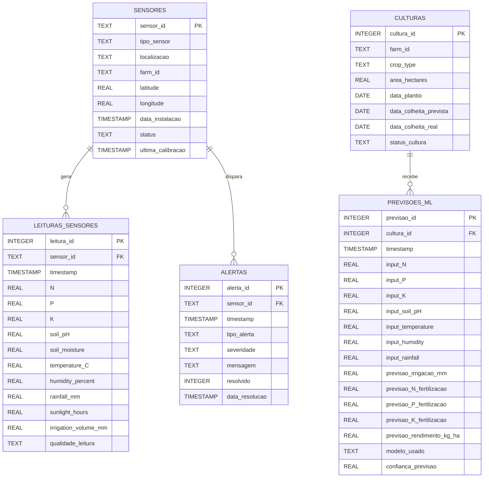

# 🗄️ FarmTech Solutions — Fase 2: Modelo Entidade-Relacionamento

Diagrama do banco de dados SQLite utilizado pelo sistema (Fase 2)
e renderizado também na página `2_🗄️_Fase2_CRUD_Banco.py` do
dashboard. O GitHub renderiza blocos `mermaid` automaticamente.

## Relacionamentos

- `sensores` **1:N** `leituras_sensores` *(um sensor gera várias leituras)*
- `sensores` **1:N** `alertas` *(um sensor pode disparar vários alertas)*
- `culturas` **1:N** `previsoes_ml` *(cada cultura recebe várias previsões)*

## Diagrama (Mermaid)

