# FIAP - Faculdade de Informática e Administração Paulista

<p align="center">
  <a href="https://www.fiap.com.br/">
    
  </a>
</p>

<br>

# 🛰️ SatVerify — Plataforma de Due Diligence Empresarial via Inteligência Espacial

---

## 👥 Equipe do Projeto

### 👨‍🎓 Integrantes

| Nome             | RM       |
|------------------|----------|
| Giovani Saavedra | RM566797 |
| [Nome 2]         | RM______ |
| [Nome 3]         | RM______ |
| [Nome 4]         | RM______ |
| [Nome 5]         | RM______ |

<!-- TODO: Giovani — preencher os nomes dos colegas acima -->

### 👩‍🏫 Orientação

**Tutor(a):** [Nome do(a) tutor(a)]  
**Coordenador(a):** André Godoi Chiovatto

<!-- TODO: confirmar/atualizar nome do(a) tutor(a) -->

---

## 📜 Descrição

Lavagem de dinheiro e fraude empresarial movimentam entre **US$ 800 bilhões e US$ 2 trilhões** por ano globalmente (UNODC). Um vetor recorrente é a declaração de **endereços empresariais incompatíveis com a operação real** — fábricas que são apenas escritórios, atacadistas que operam de boxes de comércio popular, empresas com endereço em áreas de preservação ambiental.

**SatVerify** é uma plataforma de Due Diligence empresarial (KYB/AML) que automatiza a verificação inicial de endereços declarados combinando:

- **Imagens de satélite** (Sentinel-2 / ESA) para análise espectral de densidade construída
- **Imagens aéreas de alta resolução** (Mapbox) para inspeção visual
- **Visão Computacional** (YOLOv8-OBB treinado em DOTA) para detecção de objetos
- **IA Cognitiva multimodal** (CLIP zero-shot) para classificação semântica de cena
- **LLM** (Google Gemini 2.5 Flash Lite) para geração de relatório textual de DD
- **Cloud Storage** (AWS S3) para persistência auditável com presigned URLs
- **Dashboard interativo** (Streamlit) para demonstração ao analista humano

O resultado é uma decisão estruturada (**APROVADO / ATENÇÃO / REPROVADO**) com score 0-100 e relatório de due diligence interpretável.

### 🔍 Principais Achados

- **NDBI sozinho confunde casos opostos.** O Caso 2 da nossa demo (comércio popular) tem NDBI de 77,7% — maior que o Caso 1 (Volkswagen, 45,1%). Densidade construída não distingue tipo de uso. Necessidade clara de combinar múltiplas camadas.

- **YOLO COCO falha em imagens aéreas.** O modelo padrão treinado em COCO detecta zero objetos em pátios industriais top-down. Migração para YOLOv8-OBB treinado em DOTA (dataset aéreo) foi necessária.

- **CLIP zero-shot é solução pragmática poderosa.** Após 3 iterações sem sucesso no YOLO, adotamos CLIP da OpenAI/HuggingFace. Em 30 linhas de código rodando em CPU, resolve o problema central de classificação semântica que exigiria semanas de fine-tuning de uma CNN customizada.

- **Geocoding administrativo ≠ operacional.** O endereço "Av. Volkswagen, 100" resolveu para anexo administrativo, não para a planta industrial. **Isso não é bug — é exatamente o tipo de fraude que due diligence deve detectar.**

- **3 padrões distintos de fraude detectados.** Os 3 casos da demonstração ilustram três tipos diferentes de incoerência empresarial: endereço administrativo travestido de operacional, porte declarado incompatível com tipo de zona, e endereço completamente fantasma. Cada um capturado por uma combinação diferente de sinais.

- **Graceful degradation em integrações externas.** Pipeline com 6 integrações (Nominatim, CDSE, Mapbox, Gemini, AWS, modelos ML). Implementamos fallbacks — análise local continua funcionando mesmo se Gemini ou S3 ficarem indisponíveis.

### 📁 Estrutura de pastas

- 📂 **src/**
  - 📄 `config.py` — carrega .env e valida credenciais
  - 📄 `credentials_test.py` — smoke test de todas as integrações
  - 📄 `geocoding.py` — endereço → lat/lon via Nominatim
  - 📄 `sentinel_fetcher.py` — Sentinel-2 L2A via CDSE
  - 📄 `ndbi.py` — cálculo do índice NDBI
  - 📄 `mapbox_fetcher.py` — imagem aérea Mapbox
  - 📄 `yolo_detector.py` — YOLOv8n-OBB sobre Sentinel + Mapbox
  - 📄 `clip_classifier.py` — CLIP zero-shot
  - 📄 `scoring.py` — score 0-100 + decisão
  - 📄 `report_generator.py` — Gemini gerando relatório DD
  - 📄 `s3_uploader.py` — upload, presigned URLs, bucket stats
  - 📄 `pipeline.py` — orquestração dos 9 passos
  - 📄 `run_demo.py` — rodar os 3 casos
  - 📄 `dashboard.py` — Streamlit
  - 📄 `build_pdf.py` — gerador do PDF de entrega
- 📂 **docs/**
  - 📄 `PROJECT_DECISIONS.md` — decisões arquiteturais + lições aprendidas
  - 📄 `SatVerify_GS_2026.pdf` — PDF de entrega (gerado via `build_pdf.py`)
  - 📂 **screenshots/** — capturas do dashboard
- 📂 **outputs/** — artefatos por análise (UUID)
  - 📂 `<uuid>/`
    - 📄 `metadata.json`
    - 📄 `sentinel_rgb.png`, `ndbi.png`, `mapbox_aerial.png`
    - 📄 `yolo_sentinel_annotated.png`, `yolo_mapbox_annotated.png`
    - 📄 `dd_report.md`
- 📄 `.env.example` — template de variáveis de ambiente
- 📄 `.gitignore`
- 📄 `requirements.txt`
- 📄 `README.md` — este arquivo

---

## 📸 Demonstração Visual

### Dashboard principal

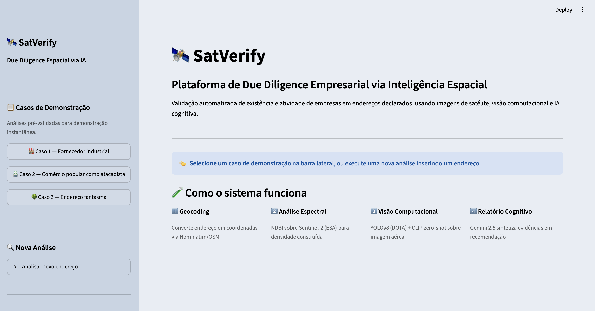
*Sidebar de controle com 3 casos pré-validados + formulário de nova análise + histórico. Área principal apresenta o produto e os 4 passos do pipeline.*

### Análise completa (Caso 1 — Volkswagen)

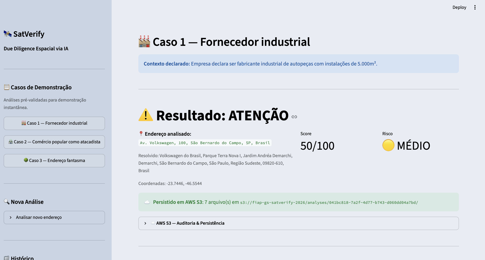
*Decisão ATENÇÃO com score 50/100 e risco MÉDIO. Endereço resolvido pelo geocoding (Parque Terra Nova I).*

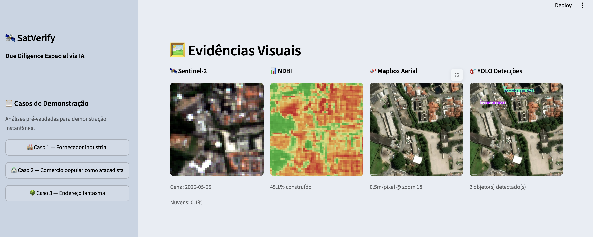
*Quatro evidências visuais: Sentinel-2 (10m/pixel), NDBI colorido, Mapbox aerial (0,5m/pixel) e detecções YOLO.*

### Integração AWS S3 enterprise

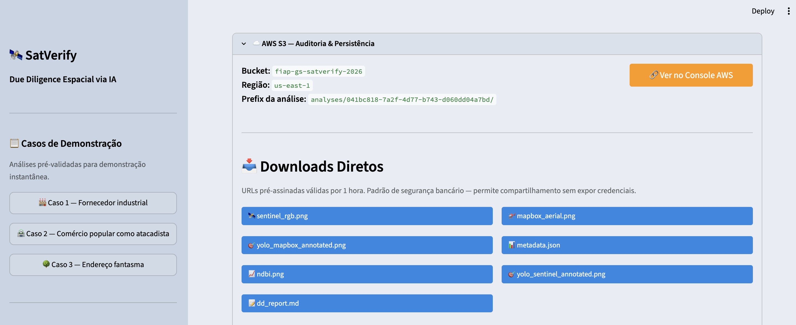
*Informações do bucket, link para o console AWS e seção de Downloads Diretos via URLs pré-assinadas (válidas por 1h).*

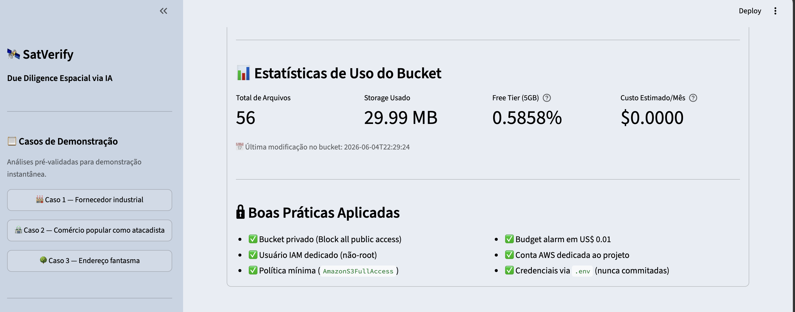
*Estatísticas de uso (storage, Free Tier, custo estimado) e checklist de boas práticas aplicadas.*

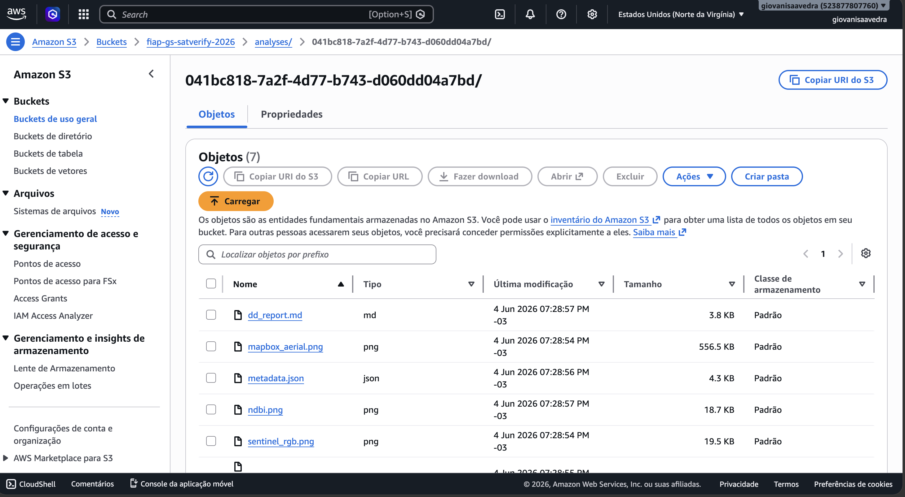
*Console AWS S3 com as análises persistidas (uma pasta por analysis_id), demonstrando integração efetiva com a nuvem.*

### Relatório de Due Diligence gerado pelo Gemini

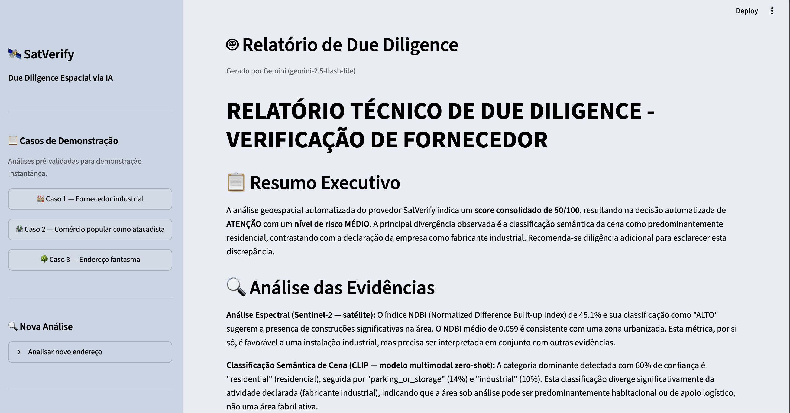
*Cabeçalho, Resumo Executivo e início da Análise das Evidências.*

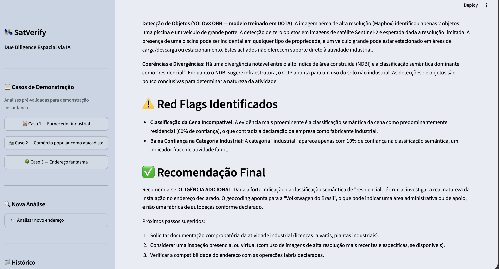
*Continuação da Análise (NDBI, CLIP, YOLO), Red Flags identificados e início da Recomendação.*

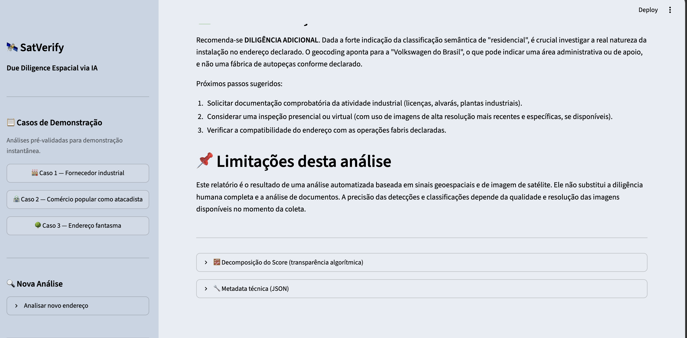
*Conclusão da Recomendação Final, próximos passos e Limitações da análise automatizada.*

### Transparência algorítmica

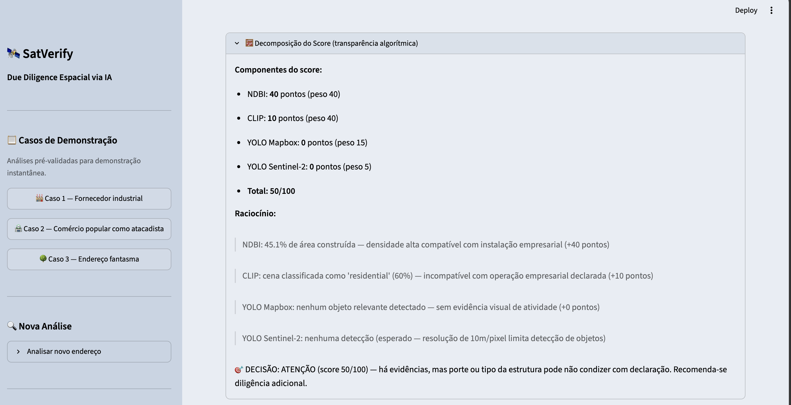
*Cada componente (NDBI, CLIP, YOLO Mapbox, YOLO Sentinel) contribui com pontuação ponderada. O analista entende exatamente como o sistema chegou à decisão final.*

---

## 🏗️ Arquitetura Técnica

```
┌─────────────────────────────────────────────────────────────────────┐
│                         USUÁRIO (Analista DD)                       │
│                                ↓                                    │
│                    Streamlit Dashboard                              │
└────────────────────────────────┬────────────────────────────────────┘
                                 │
            ┌────────────────────┼────────────────────┐
            ↓                    ↓                    ↓
    ┌───────────────┐  ┌──────────────┐  ┌────────────────┐
    │  Geocoding    │  │   Satélite   │  │  Visão Aérea   │
    │  (Nominatim)  │  │ (Sentinel-2  │  │   (Mapbox)     │
    │               │  │  via CDSE)   │  │                │
    └───────────────┘  └──────┬───────┘  └────────┬───────┘
                              ↓                   ↓
                       ┌──────────────┐  ┌────────────────┐
                       │  NDBI Index  │  │ YOLOv8-OBB     │
                       │ (área const) │  │ (DOTA) +       │
                       │              │  │ CLIP zero-shot │
                       └──────┬───────┘  └────────┬───────┘
                              ↓                   ↓
                       ┌──────────────────────────────┐
                       │  Scoring Algorithm           │
                       │  (NDBI 40 + CLIP 40 +        │
                       │   YOLO Mapbox 15 + YOLO 5)   │
                       └──────────────┬───────────────┘
                                      ↓
                       ┌──────────────────────────────┐
                       │  Gemini 2.5 Flash Lite       │
                       │  → Relatório DD em markdown  │
                       └──────────────┬───────────────┘
                                      ↓
                       ┌──────────────────────────────┐
                       │  AWS S3 (us-east-1)          │
                       │  Persistência auditável      │
                       │  + Presigned URLs            │
                       └──────────────────────────────┘
```

---

# 🔧 Como executar o código

## Execução local (recomendado)

O sistema foi desenvolvido para rodar em macOS, Linux ou Windows com Python 3.11+.

### Passo a passo

```bash
# 1. Clonar o repositório
git clone https://github.com/<seu-usuario>/satverify.git
cd satverify

# 2. Criar virtualenv
python3 -m venv .venv
source .venv/bin/activate    # Linux/Mac
# .venv\Scripts\activate     # Windows

# 3. Instalar dependências
pip install -r requirements.txt

# 4. Copiar .env.example para .env e preencher credenciais
cp .env.example .env
# Editar .env com suas chaves de API

# 5. Validar credenciais
python -m src.credentials_test

# 6. Rodar os 3 casos de demonstração
python -m src.run_demo

# 7. Abrir o dashboard
python -m streamlit run src/dashboard.py
```

A primeira execução leva ~2-3 minutos (download dos modelos YOLO ~7MB + CLIP ~600MB). Execuções seguintes são rápidas (~15-30s por análise).

O dashboard abre automaticamente em `http://localhost:8501`.

## Configuração de credenciais (.env)

```bash
# Copernicus Data Space (Sentinel-2) — gratuito
CDSE_CLIENT_ID=...
CDSE_CLIENT_SECRET=...

# Mapbox — gratuito até 50k req/mês
MAPBOX_TOKEN=...
MAPBOX_IMAGE_SIZE=1024

# Google Gemini — gratuito até 1500 req/dia
GEMINI_API_KEY=...
GEMINI_MODEL=gemini-2.5-flash-lite

# AWS S3 — Free Tier 5GB
AWS_ACCESS_KEY_ID=...
AWS_SECRET_ACCESS_KEY=...
AWS_REGION=us-east-1
AWS_S3_BUCKET=seu-bucket-aqui
```

## Pré-requisitos

- Python 3.11+
- ~2 GB de espaço em disco (modelos YOLO + CLIP)
- Contas gratuitas em: Copernicus Data Space (CDSE), Mapbox, Google AI Studio (Gemini), AWS (Free Tier)
- CPU suficiente (modelos rodam em CPU; Apple Silicon usa MPS automaticamente)

## Bibliotecas utilizadas

| Biblioteca | Versão | Uso |
|---|---|---|
| ultralytics | 8.x | Modelo YOLOv8n-OBB para detecção em imagens aéreas |
| transformers | 4.x | Modelo CLIP (HuggingFace) para classificação zero-shot |
| torch | 2.x | Framework de Deep Learning (PyTorch) |
| streamlit | 1.x | Dashboard interativo |
| sentinelhub | 3.x | SDK para acesso ao Sentinel-2 via CDSE |
| boto3 | 1.x | SDK AWS S3 (upload + presigned URLs) |
| google-genai | 0.x | SDK oficial do Google Gemini |
| Pillow | 10.x | Manipulação de imagens |
| NumPy | 1.x | Operações numéricas (NDBI) |
| python-dotenv | 1.x | Carregamento de variáveis `.env` |
| reportlab | 4.x | Geração do PDF de entrega |
| geopy | 2.x | Geocoding via Nominatim |
| matplotlib | 3.x | Visualização do NDBI |

---

## 🎯 Casos de Demonstração

O sistema foi validado com 3 casos representativos:

| # | Endereço | Contexto declarado | NDBI | CLIP | Score | Decisão |
|---|---|---|---|---|---|---|
| 1 | Av. Volkswagen, 100, SBC, SP | Fabricante industrial de autopeças | **45,1%** | residential 60% | **50** | ⚠️ ATENÇÃO |
| 2 | Rua 25 de Março, 1000, SP | Atacadista R$ 200M/ano | **77,7%** | commercial_dense 74% | **65** | ⚠️ ATENÇÃO |
| 3 | Parque da Cantareira, SP | Fábrica R$ 50M/ano | **0,0%** | green_area 100% | **0** | 🚨 REPROVADO |

Cada caso ilustra um **padrão diferente de fraude**:

- **Caso 1:** Endereço administrativo travestido de operacional (geocoding aponta para anexo, não a planta)
- **Caso 2:** Incompatibilidade entre porte declarado e tipo de zona observada
- **Caso 3:** Endereço completamente fantasma (área de preservação ambiental)

### Caso 2 — Atacadista declarado em comércio popular

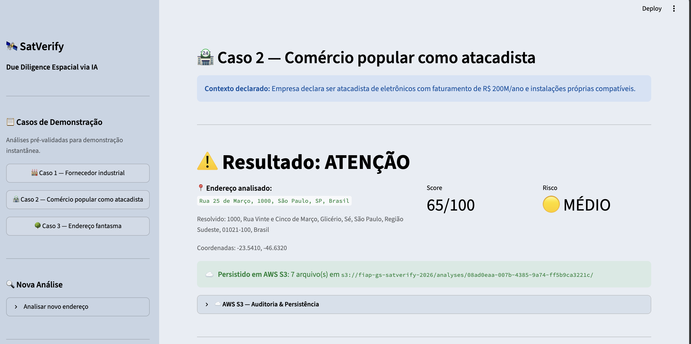
*Score 65/100, decisão ATENÇÃO. NDBI elevado (77,7%) mas zona observada incompatível com porte declarado.*

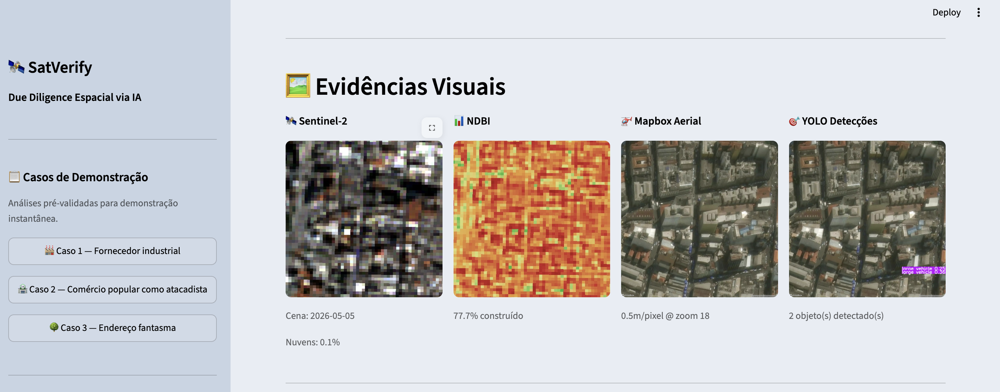
*Sentinel-2 e Mapbox revelam densidade urbana extrema típica de comércio popular. CLIP confirma: commercial_dense (74%).*

### Caso 3 — Endereço fantasma

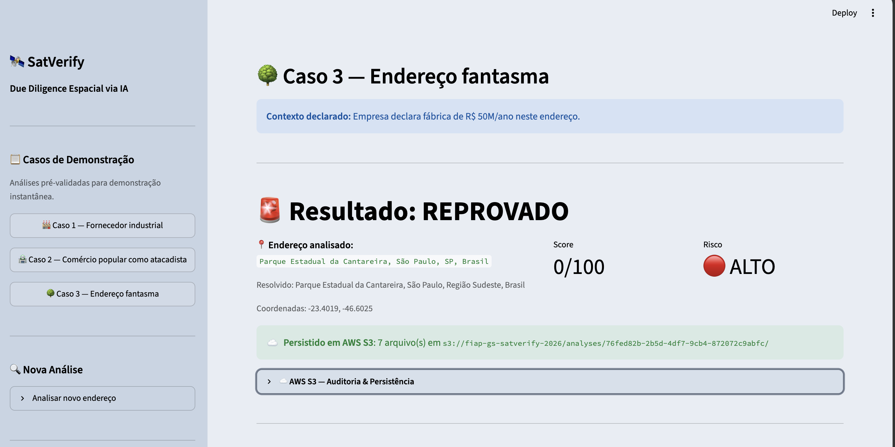
*Score 0/100, decisão REPROVADO. Endereço corresponde a unidade de conservação ambiental.*

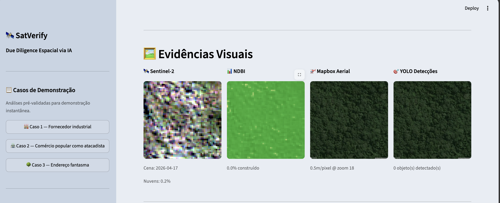
*Predominância de mata atlântica nativa. NDBI zero, CLIP green_area 100%, YOLO sem detecções.*

### Detecção YOLO sobre imagem aérea

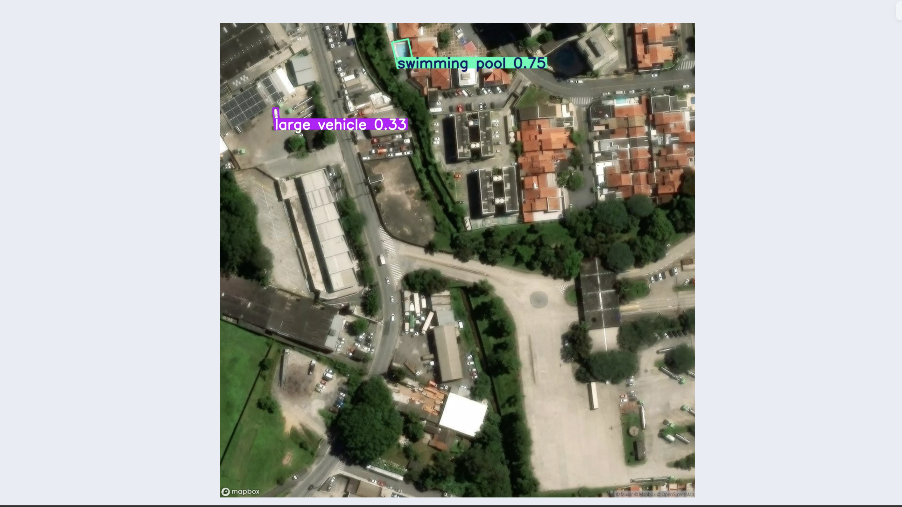
*Bounding boxes orientados do YOLOv8-OBB (treinado em DOTA) identificando objetos em imagem Mapbox de alta resolução.*

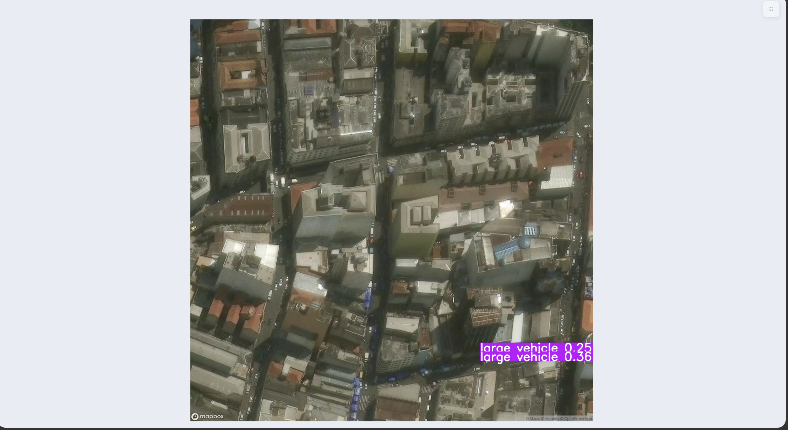
*Outro exemplo de detecção do mesmo modelo, demonstrando capacidade de identificar veículos e estruturas em ângulo aéreo top-down.*

---

## 📚 Disciplinas FIAP Integradas

Disciplinas do curso utilizadas neste projeto:

| Fase | Capítulo | Tópico | Aplicação no SatVerify |
|------|----------|--------|------------------------|
| 3 | 9 | Big Data | Sentinel-2 (5 TB/dia globalmente) |
| 3 | 10 | ML — Primeira técnica | Conceitos de treino/validação |
| 4 | 3 | Scikit-learn | Métricas de classificação |
| 4 | 4 | Streamlit | Dashboard interativo |
| 4 | 5 | Séries Temporais / Geoespacial | Dados Sentinel-2 + coords |
| 5 | 3 | SQL/NoSQL | Metadados JSON + arquivos |
| 5 | 10 | ML não-supervisionado | CLIP zero-shot |
| 6 | 9 | Deep Learning + CNN | YOLO + CLIP |
| 6 | 10 | Detecção e Segmentação | YOLOv8-OBB |
| 6 | 12 | AWS Serverless | S3 + IAM |
| 6 | 13 | Sistemas de Recomendação | Scoring algorítmico |
| 7 | 3 | IA Cognitiva / LLM | Google Gemini |

---

## 📋 Documentação Adicional

- **Documentação técnica completa:** [`docs/PROJECT_DECISIONS.md`](docs/PROJECT_DECISIONS.md)
- **PDF de entrega:** [`docs/SatVerify_GS_2026.pdf`](docs/SatVerify_GS_2026.pdf) (gerado via `python -m src.build_pdf`)

---

## 🎬 Vídeo de Demonstração

- **Apresentação SatVerify (5 minutos):** [Assistir no YouTube](https://youtu.be/PLACEHOLDER)

<!-- TODO: substituir pelo link real do YouTube após gravar -->

---

## 🗃 Histórico de lançamentos

**1.0.0** — Junho de 2026

Versão de entrega da Global Solution 2026.1. Inclui pipeline completo de 9 etapas (geocoding → Sentinel-2 → NDBI → Mapbox → YOLO → CLIP → scoring → Gemini → AWS S3), dashboard Streamlit com painel AWS enterprise, gerador automático de PDF e documentação técnica completa.

---

## 📋 Licença

 

[MODELO GIT FIAP](https://github.com/agodoi/template) por [Fiap](https://fiap.com.br) está licenciado sobre [Attribution 4.0 International](http://creativecommons.org/licenses/by/4.0/?ref=chooser-v1).

---

<p align="center"><i>SatVerify — Democratizando inteligência geoespacial para due diligence empresarial.</i></p>
